# ROC AUC Analysis for leak detection instrument

Here we explore the use of the **Receiver Operating Characteristics (ROC) Area Under the Curve (AUC)** analysis for evaluating natural gas leak detection systems. The ROC (Receiver operating characteristics) curve analysis technique is a method to analyze performance of a binary classification test.  It is commonly used in the medical and field to analyze efficacy of diagnosis tools (like cancer screening).  In our case, we treat leak detection as a task with binary outcome: leak detected or leak not found.

### Motivation

The motivation to develop this method is to facilitate performance evaluation of leak detection systems in identifying natural gas leaks.

### Controlled test to collect performance data

For the purpose of showing how ROC AUC works, we will use an example with two instruments, A and B. Performance data can be collected by conducting a series of controlled tests with the two instruments at a facility with simulated leaks. The tests involve setting up simulated leaks at various flow rates (including zeroes) and surveying the site with the instruments (one at a time) to determine if the instruments can detect each leak.

Before starting the experiments, the test organizer will have to determine what constitutes a leak (leak margin). In the simplest case, any emission above 0 cubic feet per hour (cfh) is considered a leak. However, pipeline operators may not want to deal with small non-hazardous leaks and set the leak definition margin at a higher flow rate.  

Here is a portion of the test matrix:

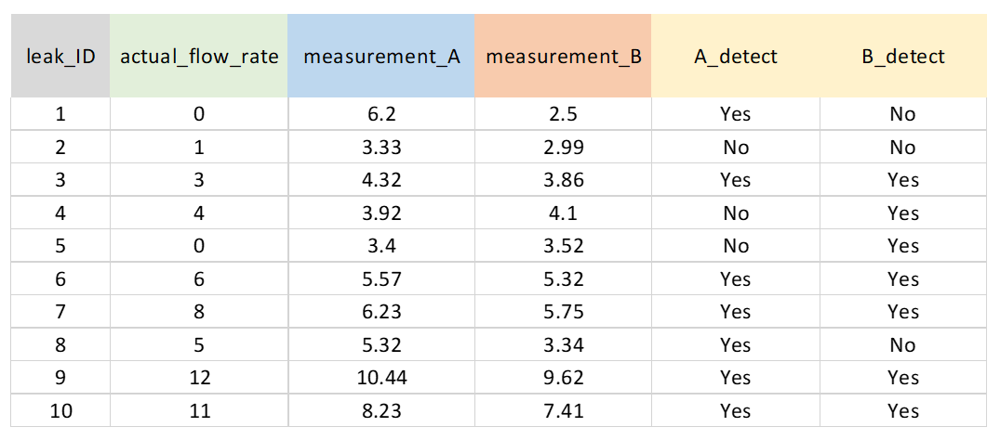

During the experiment, we collect the response of the instrument that will be used to determine leak presence. In this example, maximum concentration measurement is used to identify if a leak exists. If the maximum concentration read by an instrument exceeds a threshold, then the leak is considered as present. The threshold is usually set by the pipeline operator or vendor by managing the trade-offs between leak hazard and available resources to repair leaks. One operator may define a leak at 100 parts-per-million (ppm) methane in air while another operator may define a leak at 1,000 ppm. 

### Conventional approach to analyze data

In the conventional approach, for each leak, we record whether the instruments were able to detect the leak.

The leaks are then grouped into flow rate bins. Here is the list of bins and hypothetical data for each bin:

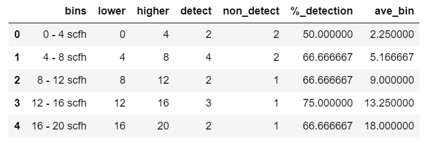

Traditionally probability detection curves are used to characterize performance of leak detection instruments. 

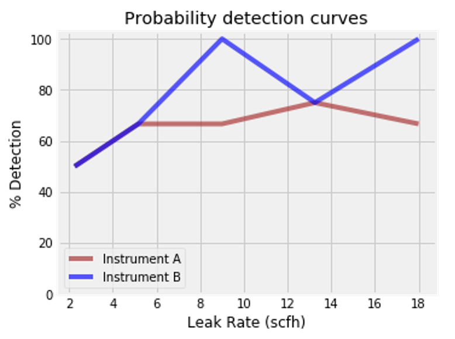

A histogram can also used to visualize the data:

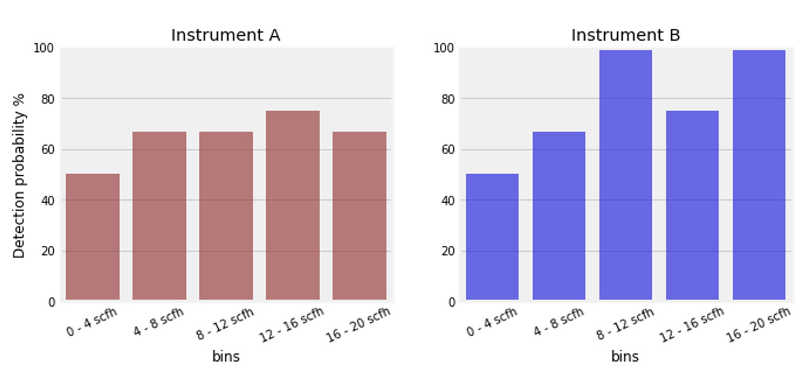

However the downside of this approach is that there is no penalty if the instrument creates false positives (false alarms). Thus, the instrument vendor may be inclined to lower the leak threshold to a very low level to create positive identification on every sign of a leak. In practice, false positives are very costly as with every positive indication a personnel has to be sent to the location to validate the leak.

A more holistic approach to analyze the instrument performance is to use the ROC AUC analysis.

### Generating performance metrics table

After the experiments have been completed, the distribution of maximum concentration readings from instrument A can be plotted. 

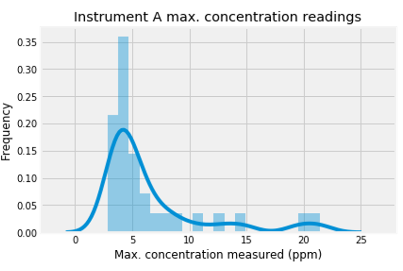

The distribution can be further broken down into positive cases/actual leaks (blue in the image below) and negative cases/blank leaks (red in the image below). The red and blue curves overlap a lot which means that the instrument is not doing a good job discriminating between leaks and non-leaks. And since the leak threshold is known (in this example 4 ppm is the threshold), the number of true positive, true negative, false positive, false negative indications can be calculated. 

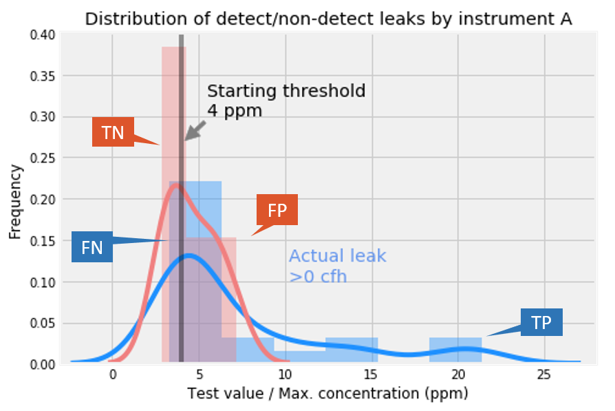

The definitions of the performance metric terms (true positive, false positive, true negative, false negative) are shown below:

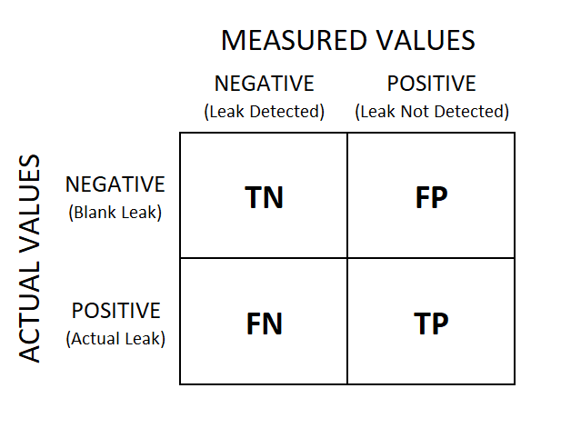

A similar analysis can be done with instrument B's results. In this case, there is much cleaner separation between the red and blue curves which indicate better ability of instrument B to distinguish between a leak and a non-leak (blank release).

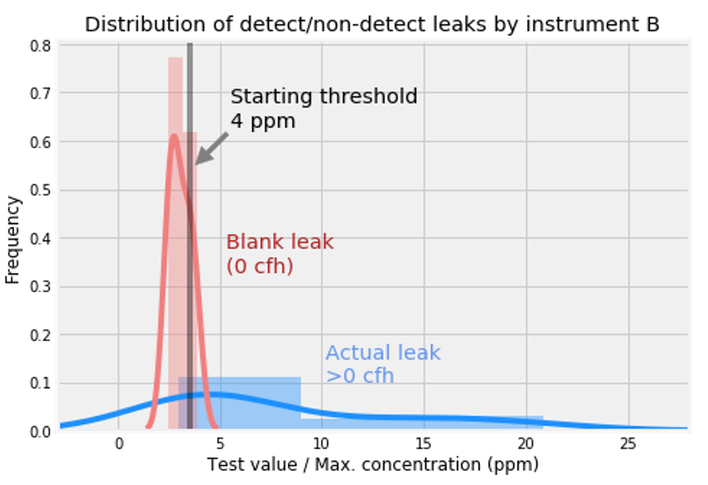

Then the true positive, true negative, false positive, and false negative numbers can be calculated across the possible range of leak threshold. Here is an example for instrument A. As can be seen, a change in threshold value would impact the performance metrics.

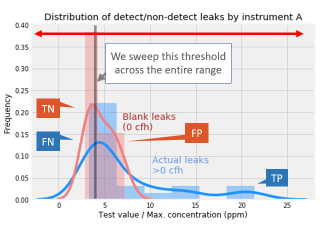

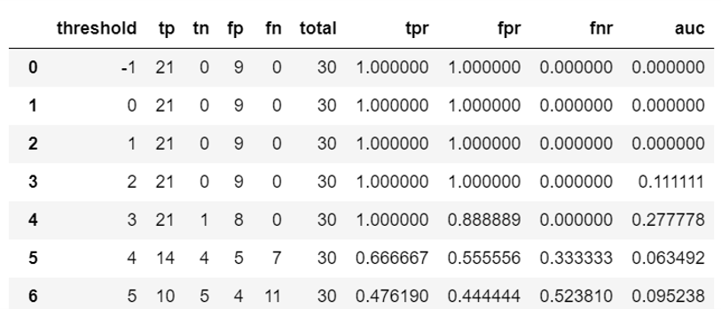

### Receiver operating characteristics (ROC) curve

Once the performance metrics table across the range of possible thresholds have been created, the receiver operating characteristics curve can be generated. In a ROC curve, the true positive rate (sensitivity) is plotted in function of the false positive rate (100-specificity). Each point on the curve represents a sensitivity/specificity pair corresponding to a particular decision threshold (or leak definition threshold).

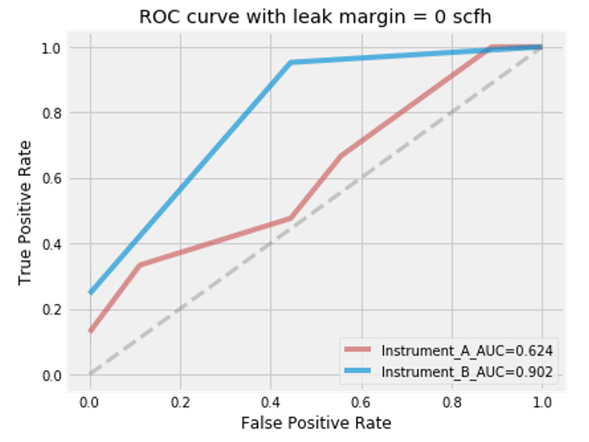

A leak detection method with perfect discrimination of leak vs. no leak has a ROC curve that passes through the upper left corner (100% sensitivity, 100% specificity). Therefore the closer the ROC curve to the upper left corner, the higher the overall accuracy of the method. If the method has no ability to distinguish leak vs. no leak and randomly guesses the outcome, the curve will be a straight diagonal. If the method is wrong 100% of the time then the curve will be flat along the horizontal axis.

We can also calculate the Area Under the Curve (AUC) to indicate how well the method performs. The AUC ranges in value from 0 to 1. The larger the AUC the closer is ROC curve to the upper left corner. When the performance is a random guess, the AUC score will be 0.5. Thus the AUC provides an aggregate measure of performance for the method.

For the example above, it can be observed that instrument B performed better than instrument A as evident in the higher AUC score. The curve of instrument B is always above instrument A across the different thresholds used. 

Another way to visualize the data is through the use of detection error tradeoff curve. A detection tradeoff curve shows the relationship between false negative rate (missed leaks) and false positive rate. In this example, it is clear that Instrument B has lower false negative rates (less missed leaks) than instrument A across all thresholds. 

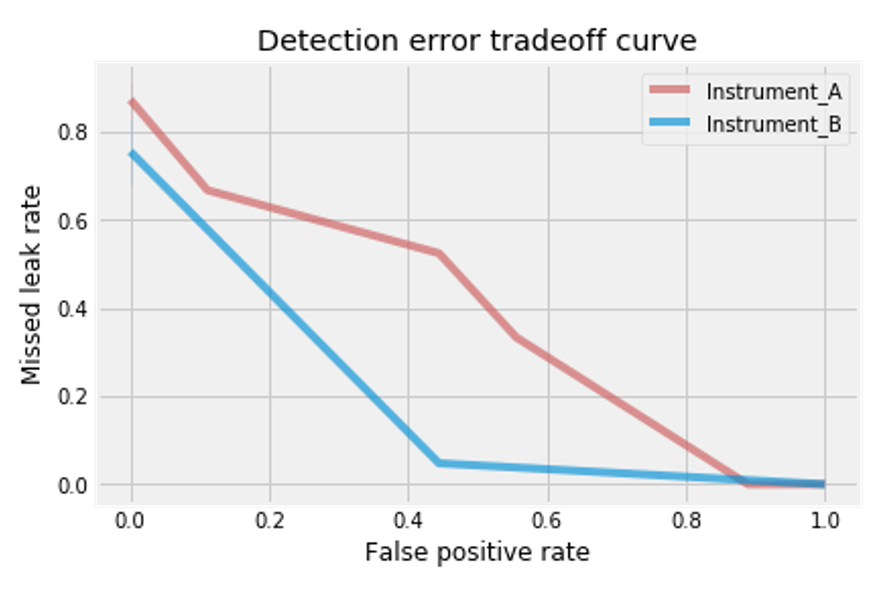

### Changing the leak margins

We can also check how the instruments perform for different leak definition margins. Remember that a leak margin is the flow rate that defines a leak. A leak margin of 2 cubic feet per hour means that emissions below this flow rate is not considered a leak while emissions above this flow rate is a leak. 

In the plots below, the leak margin was changed to 2 and 5 cubic feet per hour. 

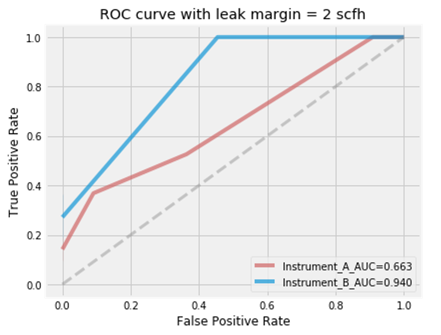

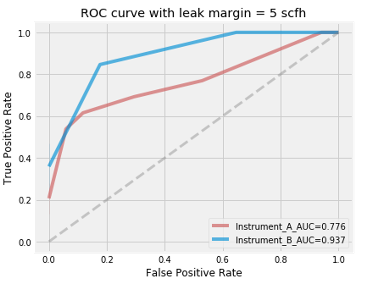

Instrument A performs significantly better (higher AUC score) at higher leak margins. Instrument B enjoyed a modest gain in performance (AUC score) by increasing the leak margin from 0 to 2 cfh but no improvement from 2 to 5 cfh. 

### Credits
This study and report were completed by Gerry Bong. 